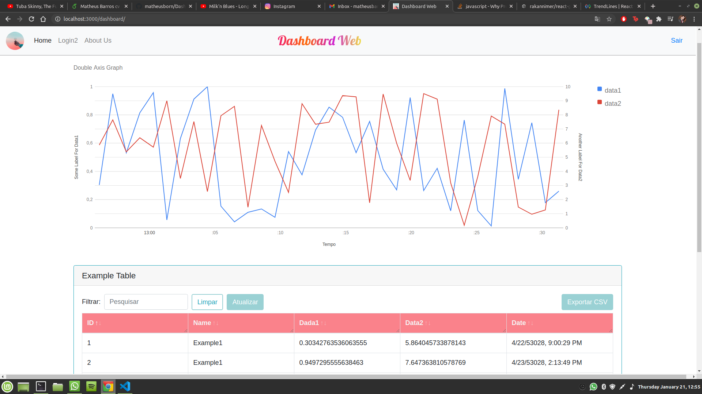

# dashboard

Remote repo for the Dashboard Web Project.

How to use:
  1. download code
  2. extract
  3. npm install
  4. npm start
  
Screenshots:

  Login Page
  
  
  Alternative Login Page
  

  Home Page (Table only)
  
  
  Home Page (Table and Graph)
  
